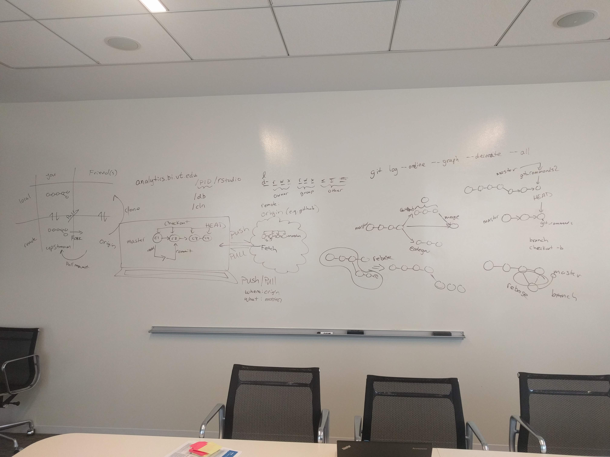

# Version Control

[Software-Carpentry Git Lesson][3]

DataCamp Courses:

- [Introduction to Git for Data Science][1]
- [Working with the RStudio IDE (Part 2) -- Chapter 2: Version Control][2]

Quick References:

1. [Software-Carpentry Reference][5]
2. [Git Cheat Sheet (by Github)][4]
3. [Jenny Bryan's "Happy Git and GitHub for the useR"][6]
4. [Git interaction from NDP Software][7]
5. [Learn Git Branching][8]

[Git flight rules for when you mess up][9]

## Git 

Git and the "final" version problem

If these comics bring back haunting memories, then version control is for you!


Technically, renaming copies of files is a form of version control.
It allows you to go back to a specific state of a file.
As the two comics point out, this usually ends up in a cacophony of files with similar names.

What about files and programs that know how to track changes already.
I'm mainly thinking about Word documents.

## Git setup

In a terminal:

```bash
git config --global user.name "Vlad Dracula"
git config --global user.email "vlad@tran.sylvan.ia"
git config --global color.ui auto
git config --global core.editor "nano -w"
```

Optional setup (aliases)

```bash
git config --global alias.l 'log --oneline --graph --decorate --all'
git config --global alias.last 'log -1 HEAD'

git config --global alias.co checkout
git config --global alias.br branch
git config --global alias.ci commit
git config --global alias.st status
```

## Git on your own

<div class="figure" style="text-align: center">

<p class="caption">(\#fig:unnamed-chunk-4)Diagram of Git commands and how they relate to one another.</p>
</div>

- `git init`: turn the current folder into a git repository
- `git status`: let's you know what is going on **run this all the time!**
- `git add`: put file(s) into your "staging area"
- `git commit -m 'MY COMMIT MESSAGE'`: commits files in the "staging area" with the given message
- `git diff <file name>`: compares saved changes to a file to the last commited version of the file
- `git diff --staged <file name>`: compares a staged file to the last commited version of the file

- `git log` and `git log --oneline`: looks at your git history
- `git log --oneline --graph --decorate --all`: gives detailed log information about where you are

How not to write commit messages:

<!-- pandoc-citeproc: reference chendaniely not found -->

<center>
<blockquote class="twitter-tweet" data-lang="en"><p lang="en" dir="ltr">how <a href="https://twitter.com/hashtag/not?src=hash&amp;ref_src=twsrc%5Etfw">#not</a> to write <a href="https://twitter.com/hashtag/git?src=hash&amp;ref_src=twsrc%5Etfw">#git</a> <a href="https://twitter.com/hashtag/commit?src=hash&amp;ref_src=twsrc%5Etfw">#commit</a> messages  -.-&#39;&#39; <a href="http://t.co/5TdiZ1yi5S">pic.twitter.com/5TdiZ1yi5S</a></p>&mdash; Dⓐniel Chen (@chendaniely) <a href="https://twitter.com/chendaniely/status/588826374208618496?ref_src=twsrc%5Etfw">April 16, 2015</a></blockquote>
<script async src="https://platform.twitter.com/widgets.js" charset="utf-8"></script>
</center>

## Working with remotes

- `git clone <repo url>`: downloads code from a code repository into your current directory
- `git remote -v`: lists all the remotes and their short names (e.g., origin, upstream)
- `git remote add <name> <url>`: adds the `<url>` to your remotes and gives it the short name `<name>` (e.g., `git remote add origin <URL>`)
- `git remote rm <name>`: removes a remote by its shortname

- `git push <where> <what>`: pushes code on the `<what>` branch to the `<where>` remote (e.g., `git push origin master`)
- `git pull <where> <what>`: pulls does down from the `<what>` branch from the `<where>` remote (e.g., `git pull origin master`)

## Git with branches

<div class="figure" style="text-align: center">

<p class="caption">(\#fig:unnamed-chunk-5)Review of Git</p>
</div>

<div class="figure" style="text-align: center">

<p class="caption">(\#fig:unnamed-chunk-6)What branching looks like in the Git world</p>
</div>

- `git branch <new branch name>`: creates a new branch called `<new branch name>`
- `git checkout <new branch name>`: goes to the branch, `<new branch name>`
    - `git checkout -b <new branch name>`: creates and checksout a branch in a single step
- `git log --oneline --graph --decorate --all`: shows you the log in relation to all other branches

## Collaborating with Git

This is like working with branches, but instead of you working on a branch, it's someone else

<div class="figure" style="text-align: center">

<p class="caption">(\#fig:unnamed-chunk-7)The 'forking' model of Git workflows</p>
</div>

<div class="figure" style="text-align: center">

<p class="caption">(\#fig:unnamed-chunk-8)Git with branches</p>
</div>

## Protecting branches

https://docs.gitlab.com/ee/user/project/protected_branches.html

In a repository go to settings > repository > protected branches

set

- "allowed to merge": masters
- "allowed to push": no one

## Help! (FAQ)

Link to more "flight rules", for when you [really mess up][9].

### General workflow

1. Make sure your `master` branch is up to date
    1. Go to the `master` branch: `git checkout master`
    2. Update your `master` branch: `git pull origin master`
2. Create a new branch (give it a useful name): `git checkout -b my_awesome_task`
    - Give your branch a sensible name about what you are working on
    - Don't just give it your name or pid, nobody knows what you are doing
3. Go code and write commits!
    1. `git add <my file>`
    2. `git commit -m 'look at all this cool stuff'`
4. Push your branch `git push origin my_awesome_task`
5. Issue a pull request
6. Have someone (maintainers) review your code
    - Does it follow coding style guides?
    - Is the code "good"
        - No datasets are checked in
        - No loops when an `apply` or `map` function would suffice
        - There are functions for repetitive code
        - Are you checking your work?
            - Are the assumptions you are making about data tested in code?
            - If you are visually checking/inspecting your data to check your code,
              is there code written for your visual check?
        - etc
7. (Maintainers) merge the pull request
    - You can also checkoff a box that will also delete the branch on the remote
    - Or delete the branch manually under the `branches` view
8. Go back to master: `git checkout master`
9. Pull down your merged code: `git pull origin master`
10. Delete your branch: `git branch -d my_awesome_task` (note it is a **lower case** d)
11. Clean up your branches: `git fetch --prune`

### Git push rejected (master)

When you run `git status`, does it say you're on `master`?
Please see below: "Accidently did work on `master`".

### Accidently did work on `master`:

1. Create a branch where you are now: `git branch BRANCH_NAME`
2. Find the commit hash of where master is supposed to be
    - `git log --oneline --graph --decorate --all`
3. Reset master to where you were: `git reset --hard COMMIT_HASH_FOR_MASTER`
    - make sure you do this on the `master` branch
4. Go to your branch: `git checkout BRANCH_NAME`
5. Push your branch: `git push origin BRANCH_NAME`
6. Create and merge the pull/merge request

### Get changes from master on your branch

Scenario: You are working on your branch, and the master branch changes (e.g., someone else gets their branch merged into master).
The changes in master are also changes you need (e.g., the update to master is a function that you want to use),
but you are still working on your branch and not ready to create a pull/merge request and/or merge your changes yet.

1. Go to your `master` branch: `git checkout master`
2. Get the new updates from `master`: `git pull origin master`
3. Go back to your branch: `git checkout my_branch`
4. Rebase your branch against master: `git rebase master`
    - You may or may not need to solve merge conflicts.
5. Force push your branch: `git push -f origin my_branch`


### Remote server (e.g., GitLab, GitHub, Bitbucket, etc) shows merge conflict

When you attempt to merge a pull/merge request and tells you that the branch cannot be merged becuase of a merge conflict,
you need to follow the same steps from "Get changes from master on your branch".
During the rebasing step, you will be fixing the merge conflict(s).


### Remove data/files from history

#### BFG repo cleaner

- https://rtyley.github.io/bfg-repo-cleaner/

#### Git filter branch

```bash
git filter-branch --force --index-filter \
'git rm --cached --ignore-unmatch <PATH_TO_FILE>' \
--prune-empty --tag-name-filter cat -- --all
```

as a single line:

```bash
git filter-branch --force --index-filter 'git rm --cached --ignore-unmatch <PATH_TO_FILE>' --prune-empty --tag-name-filter cat -- --all
```

[1]: https://www.datacamp.com/courses/introduction-to-git-for-data-science
[2]: https://www.datacamp.com/courses/working-with-the-rstudio-ide-part-2
[3]: http://swcarpentry.github.io/git-novice/
[4]: https://services.github.com/on-demand/downloads/github-git-cheat-sheet.pdf
[5]: http://swcarpentry.github.io/git-novice/reference.html
[6]: http://happygitwithr.com/
[7]: http://ndpsoftware.com/git-cheatsheet.html
[8]: https://learngitbranching.js.org/
[9]: https://github.com/k88hudson/git-flight-rules
