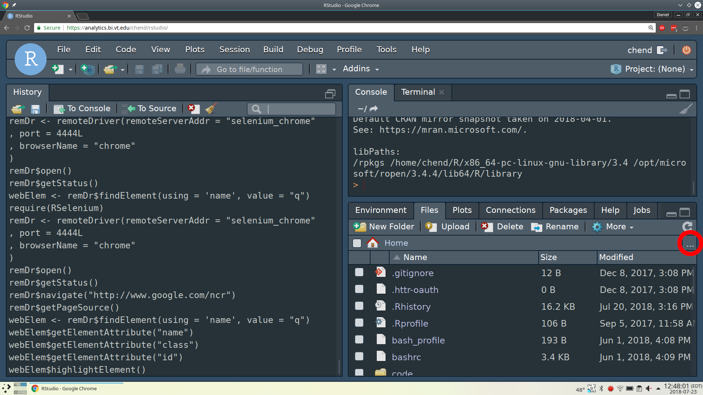
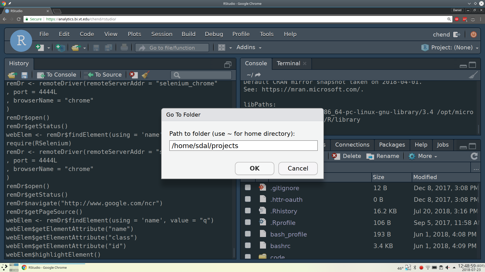

# RStudio

## Restarting RStudio Session

### Within RStudio

Session > Restart R (Ctrl + Shift + F10)

### From the terminal

When RStudio locks up and you need to restart it.
Note you will need to be on the VPN if you are not on the VT wireless.

1. Open a terminal
3. Look for your rstudio process by running: `ps aux | grep rstudio`
```bash
> ps aux | grep chend | grep rstudio
chend    163630  0.3  0.0 743120 100936 ?       Sl   09:51   0:04 /usr/lib/rstudio-server/bin/rsession -u chend --launcher-token 59FDC2A5
chend    182064  0.0  0.0 112708   968 pts/0    S+   10:14   0:00 grep --color=auto rstudio
```
4. Note which process rstudio is running on by looking at the 2nd column in the output (next to your pid),
in this example the process number is `163630`
5. Stop the process: `kill -9 <Process number here>`

## Accessing folders

### Outside of Home

Sometimes you might want to navigate outside your home directory.
To do this first click the 3 dots in the files panel to manually input a directory.

<div class="figure" style="text-align: center">

<p class="caption">(\#fig:unnamed-chunk-2)Go to a specific directory</p>
</div>

Then you can manually navigate into a different path.

<div class="figure" style="text-align: center">

<p class="caption">(\#fig:unnamed-chunk-3)Manually input directory</p>
</div>

This example specifically shows navigating to the `/home/sdal/projects` directory.
However, you might want to check your project's `data` folder,
a link to the relevant data folder should already be in there.
