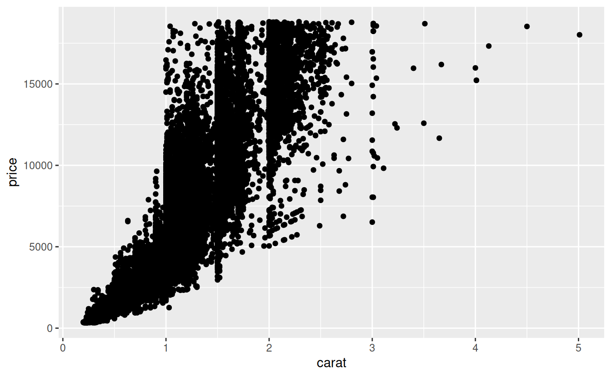
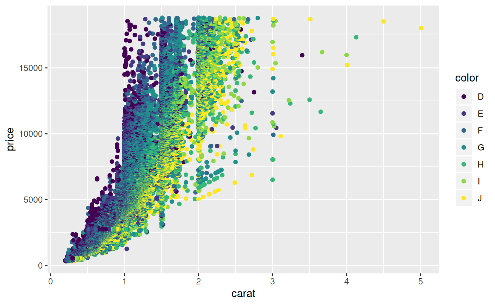

# Bookdown

https://bookdown.org/yihui/bookdown/


```r
install.packages("bookdown")
```


Minimal bookdown example:

- Code: https://github.com/rstudio/bookdown-demo
- Site: https://bookdown.org/yihui/bookdown-demo/


## Components of a book

### Section titles:

```
# Preface {-}
```

```
# Part 1: The beginning {-}
```

```
# Chapter 1: Introduction

## Example One

## Example Two
```

## Rendering M-K vs K-M

- M-K: merge all documents first, then knit
- K-M: Knit each document separately, then merge together

- Default is M-K, but you can change this option in `_bookdown.yml`, `new_session: yes` vs `new_session: no`

## Looking at the book while you work

- Preview book add-on
  - Will recompile the book on each save
- 

## Figures


```r
library(ggplot2)
```


```r
ggplot(diamonds, aes(x = carat, y = price)) +
  geom_point()
```




```r
ggplot(diamonds, aes(x = carat, y = price, color = color)) +
  geom_point()
```

<div class="figure" style="text-align: center">

<p class="caption">(\#fig:diamond-colored)A figure caption.</p>
</div>

````markdown
` ``{r diamond-colored, fig.cap = 'A figure caption.'}
ggplot(diamonds, aes(x = carat, y = price, color = color)) +
  geom_point()
` ``
````
You can reference Figure \@ref(fig:diamond-colored) by the chunk name with `\@ref(fig:diamond-colored)`

## Tables


```r
knitr::kable(
  head(mtcars[, 1:8], 10), booktabs = TRUE,
  caption = 'A table of the first 10 rows of the mtcars data.'
)
```


Table: (\#tab:mtcars-head-table)A table of the first 10 rows of the mtcars data.

                      mpg   cyl    disp    hp   drat      wt    qsec   vs
------------------  -----  ----  ------  ----  -----  ------  ------  ---
Mazda RX4            21.0     6   160.0   110   3.90   2.620   16.46    0
Mazda RX4 Wag        21.0     6   160.0   110   3.90   2.875   17.02    0
Datsun 710           22.8     4   108.0    93   3.85   2.320   18.61    1
Hornet 4 Drive       21.4     6   258.0   110   3.08   3.215   19.44    1
Hornet Sportabout    18.7     8   360.0   175   3.15   3.440   17.02    0
Valiant              18.1     6   225.0   105   2.76   3.460   20.22    1
Duster 360           14.3     8   360.0   245   3.21   3.570   15.84    0
Merc 240D            24.4     4   146.7    62   3.69   3.190   20.00    1
Merc 230             22.8     4   140.8    95   3.92   3.150   22.90    1
Merc 280             19.2     6   167.6   123   3.92   3.440   18.30    1

````markdown
` ``{r, mtcars-head-table}
knitr::kable(
  head(mtcars[, 1:8], 10), booktabs = TRUE,
  caption = 'A table of the first 10 rows of the mtcars data.'
)
` ``
````

Table \@ref(tab:mtcars-head-table) can be referenced with `\@ref(tab:mtcars-head-table)`

## Cross refrence chapters {#cross-ref}

Cross references to other chapters can be done with `\@ref(label)`.
Reference labels are auto created for you,
but it's better to create your own labels with `{#id}`.
E.g., this chapter, Section \@ref(cross-ref), was done by placing `## Cross refrence chapters {#cross-ref}`
as the header.
